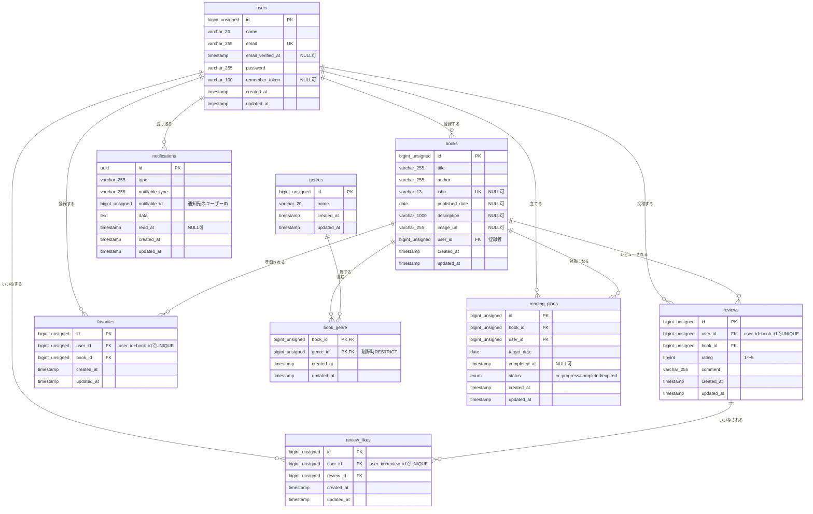

# Bookshelf 書籍レビュー・管理アプリ

## 概要

読んだ本・読みたい本を登録し、レビューや読書計画で管理できる Laravel 製の書籍管理アプリです。
プログラミングスクール（コーチテック）の課題として開発しています。

## 主な機能

| 分類 | 内容 |
|---|---|
| 認証 | 会員登録・ログイン・ログアウト |
| 書籍管理 | 一覧（検索・ジャンル絞り込み・並び替え）、詳細、登録、編集、削除。登録者本人のみ編集・削除可 |
| ISBN検索 | ISBNを入力すると Google Books API から書籍情報を取得し、登録フォームに自動入力 |
| ジャンル管理 | ジャンルの一覧・登録・編集・削除。書籍には1つ以上のジャンルを紐づけ |
| レビュー | 評価（1〜5）とコメントの投稿・編集・削除。1書籍につき1ユーザー1件。レビューへの「いいね」 |
| お気に入り | 書籍のお気に入り登録・解除、一覧 |
| ランキング | 平均評価の高い順（同点はレビュー件数順）のランキング |
| マイ読書レポート | ログインユーザー自身の読書状況のレポート |
| 読書計画 | 書籍ごとに期日を設定。ステータスは「進行中」「完了」「期限切れ」。期日の変更、読了操作、削除 |
| 通知 | ヘッダーのベルアイコンから通知一覧を表示し、既読にできる |
| 日次バッチ | 毎日20:00に、期限切れへの更新と読書計画のリマインダー通知を実行（後述） |
| 公開API | 書籍の一覧・詳細取得（認証不要）、登録・更新・削除（Sanctumトークン認証） |

## 使用技術

- PHP 8.5 / Laravel 10
- MySQL 8.4（開発）、SQLite in-memory（テスト）
- Laravel Sanctum（API認証）
- Blade / Tailwind CSS / @tailwindcss/forms / Alpine.js / Vite
- Docker / Laravel Sail / phpMyAdmin（開発環境）

## 作成者

ユウイチロウ

## 開発環境URL

| 用途 | URL |
|---|---|
| アプリケーション | http://localhost |
| phpMyAdmin | http://localhost:8080 |

## ER図



※ 上記は、テーブル仕様書とマイグレーションの内容に合わせて記載しています（型の括弧内の数字は文字数、たとえば `varchar_255` は `varchar(255)` を表します）。

## 環境構築

Docker と Composer が使える環境を前提にしています。

```bash
# 1. 依存パッケージのインストール
composer install

# 2. 環境変数ファイルの作成
cp .env.example .env
```

`.env` を次のように編集します（Sail の MySQL コンテナに接続する場合）。

```dotenv
DB_HOST=mysql
DB_DATABASE=laravel
DB_USERNAME=sail
DB_PASSWORD=password

# ISBN検索機能で使用（Google Books API のAPIキー）
GOOGLE_BOOKS_API_KEY=
```

```bash
# 3. コンテナの起動
./vendor/bin/sail up -d

# 4. アプリケーションキーの生成・マイグレーション・初期データ投入
./vendor/bin/sail artisan key:generate
./vendor/bin/sail artisan migrate --seed

# 5. フロントエンドのビルド（開発時は dev）
./vendor/bin/sail npm install
./vendor/bin/sail npm run dev
```

起動後、http://localhost にアクセスします（phpMyAdmin は http://localhost:8080）。

### 初期データ

`migrate --seed` で、ユーザー・ジャンル・書籍・レビュー・お気に入り・いいね・読書計画のサンプルデータが投入されます。
書籍の登録者、レビューの投稿者・評価・コメント、いいねはランダムに割り当てられます（実行のたびに内容が変わります）。
ユーザーは次の5名で、パスワードはすべて `password` です。

`yamada@example.com` / `suzuki@example.com` / `tanaka@example.com` / `sato@example.com` / `takahashi@example.com`

読書計画は、実行日を起点とした期日で6件が登録されます（動作確認用）。

| 対象ユーザー | 期日 | ステータス | 確認できること |
|---|---|---|---|
| 山田太郎 | 3日後 | 進行中 | 3日前の予告リマインダーの対象 |
| 山田太郎 | 当日 | 進行中 | 当日の最終警告リマインダーの対象 |
| 山田太郎 | 3日前 | 進行中 | 日次バッチで「期限切れ」に更新され、3日後の再エンゲージメント通知の対象にもなる |
| 山田太郎 | 7日後 | 進行中 | リマインダーの対象外 |
| 山田太郎 | 10日前 | 完了 | 完了済みの計画（編集・読了はできない） |
| 鈴木花子 | 5日後 | 進行中 | 山田太郎でログインして `/reading-plans/6/edit` を開くと403になる |

## 日次バッチ（読書計画）

コマンド `reading-plans:daily` を、Laravel Scheduler が毎日 20:00（`Asia/Tokyo`）に実行します（`app/Console/Kernel.php`）。
このコマンドは次の順に処理します。順序が重要で、必ず期限切れへの更新を先に行い、その後に通知対象を判定します。

1. `reading-plans:expire` … 期日を過ぎた「進行中」の計画を「期限切れ」に更新
2. `reading-plans:remind` … 次の通知を送信

| 対象 | 通知 |
|---|---|
| 期日の3日前・進行中 | 予告リマインダー（`upcoming`） |
| 期日当日・進行中 | 最終警告リマインダー（`final`） |
| 期日の3日後・期限切れ | 再エンゲージメント通知（`re_engagement`） |

期限切れへの更新は画面表示時には行わず、このバッチのみで行います。そのため、期日を過ぎても次の20:00までは「進行中」と表示されます。

### スケジューラの起動

Scheduler は「1分ごとに `schedule:run` を呼ぶ仕組み」が別途必要です。

```bash
# ローカル開発（別ターミナルで起動しておく）
./vendor/bin/sail artisan schedule:work

# 本番環境では cron に登録
* * * * * cd /path/to/bookshelf-app && php artisan schedule:run >> /dev/null 2>&1
```

20:00 を待たずに動作確認する場合は、コマンドを直接実行します。

```bash
./vendor/bin/sail artisan reading-plans:daily
```

## 公開API

書籍の一覧・詳細は認証不要、登録・更新・削除は Sanctum のトークン認証（Bearer Token）が必要です。

| メソッド | パス | 概要 | 認証 |
|---|---|---|---|
| GET | `/api/v1/books` | 書籍一覧の取得（キーワード検索・ジャンル絞り込み・ページネーション） | 不要 |
| GET | `/api/v1/books/{book}` | 書籍詳細の取得（ジャンル・レビュー一覧を含む） | 不要 |
| POST | `/api/v1/books` | 書籍の新規登録 | 必要 |
| PUT | `/api/v1/books/{book}` | 書籍の更新（登録者本人のみ） | 必要 |
| DELETE | `/api/v1/books/{book}` | 書籍の削除（登録者本人のみ） | 必要 |

トークン発行用のエンドポイントは用意していません。動作確認用のトークンは tinker で発行します。

```bash
./vendor/bin/sail artisan tinker
>>> App\Models\User::find(1)->createToken('test')->plainTextToken
```

詳細は [docs/api-spec-books.md](docs/api-spec-books.md) を参照してください。

## テスト

```bash
./vendor/bin/sail artisan test
```

テストは SQLite のインメモリDBで実行されます（`phpunit.xml`）。
テストの内容は `テストケース一覧.xlsx` に定義しており、テストコードは `tests/` 配下に配置しています。

## ドキュメント

| ファイル | 内容 |
|---|---|
| `テストケース一覧.xlsx` | テストケース一覧（大項目・項目・テスト手順・期待挙動・テストファイル） |
| `テーブル仕様書.xlsx` | 各テーブルのカラム定義・制約・備考 |
| `erd.png` / `erd.drawio` | ER図（旧版。最新のER図は README 内の Mermaid 図を参照） |
| [docs/api-spec-books.md](docs/api-spec-books.md) | 書籍API仕様書 |
| [docs/validation-spec.md](docs/validation-spec.md) | バリデーション仕様書（FormRequestごとのルール・エラーメッセージ・利用箇所） |

## 主なバリデーション仕様（書籍登録・編集）

| 項目 | ルール |
|---|---|
| タイトル | 必須・255文字以内（重複可） |
| 著者名 | 必須・255文字以内 |
| ISBN | 任意・13桁の数字・重複不可（編集時は自分自身を除く） |
| 出版日 | 任意・日付形式 |
| 説明 | 任意・1000文字以内 |
| 画像URL | 任意・URL形式・255文字以内 |
| ジャンル | 必須（1つ以上選択） |

レビューは、評価（1〜5の整数）・コメント（255文字以内）ともに必須です。
