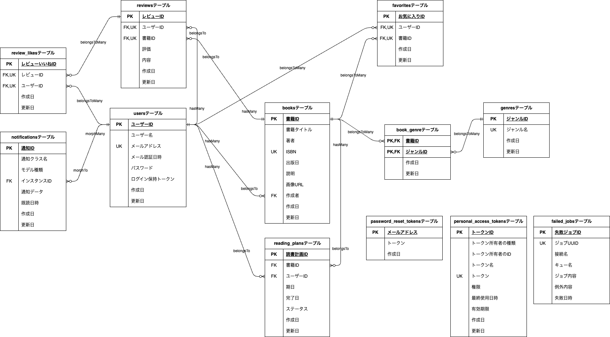

# Bookshelf 書籍レビュー・管理アプリ

## 概要

読んだ本・読みたい本を登録し、レビューや読書計画で管理できる Laravel 製の書籍管理アプリです。
プログラミングスクール（コーチテック）の課題として開発しています。

## 主な機能

| 分類 | 内容 |
|---|---|
| 認証 | 会員登録・ログイン・ログアウト |
| 書籍管理 | 一覧（検索・ジャンル絞り込み・並び替え）、詳細、登録、編集、削除。登録者本人のみ編集・削除可 |
| ISBN検索 | ISBNを入力すると Google Books API から書籍情報を取得し、登録フォームに自動入力 |
| ジャンル管理 | ジャンルの一覧・登録・編集・削除。書籍には1つ以上のジャンルを紐づけ |
| レビュー | 評価（1〜5）とコメントの投稿・編集・削除。1書籍につき1ユーザー1件。レビューへの「いいね」 |
| お気に入り | 書籍のお気に入り登録・解除、一覧 |
| ランキング | レビューの平均評価が高い書籍の上位10件（並び順は「一覧画面の並び順」を参照） |
| マイ読書レポート | ログインユーザー自身の読書状況のレポート |
| 読書計画 | 書籍ごとに期日を設定。ステータスは「進行中」「完了」「期限切れ」。期日の変更、読了操作、削除 |
| 通知 | ヘッダーのベルアイコンから通知一覧を表示し、既読にできる |
| 日次バッチ | 毎日20:00に、期限切れへの更新と読書計画のリマインダー通知を実行（後述） |
| 公開API | 書籍の一覧・詳細取得（認証不要）、登録・更新・削除（Sanctumトークン認証） |

## 使用技術

- PHP 8.5 / Laravel 10
- MySQL 8.4（開発）、SQLite in-memory（テスト）
- Laravel Fortify（会員登録・ログイン認証）
- Laravel Sanctum（API認証）
- Blade / Tailwind CSS / @tailwindcss/forms / Alpine.js / Vite
- Docker / Laravel Sail / phpMyAdmin（開発環境）

## 開発環境URL

| 用途 | URL |
|---|---|
| アプリケーション | http://localhost |
| phpMyAdmin | http://localhost:8080 |

## ER図



※ 認証・システム補助のテーブル（`password_reset_tokens`、`personal_access_tokens`、`failed_jobs`）は、他のテーブルと外部キーで関連していないため、関連線を引かずに記載しています（定義はテーブル仕様書を参照）。

## 環境構築

Docker と Composer が使える環境を前提にしています。

```bash
# 1. 依存パッケージのインストール
composer install

# 2. 環境変数ファイルの作成
cp .env.example .env
```

`.env` を次のように編集します（Sail の MySQL コンテナに接続する場合）。

```dotenv
DB_HOST=mysql
DB_DATABASE=laravel
DB_USERNAME=sail
DB_PASSWORD=password

# ISBN検索機能で使用（Google Books API のAPIキー）
GOOGLE_BOOKS_API_KEY=
# Google Books API のエンドポイント（通常は変更不要。未設定の場合もこの値が使われる）
GOOGLE_BOOKS_API_URL=https://www.googleapis.com/books/v1/volumes
```

```bash
# 3. コンテナの起動
./vendor/bin/sail up -d

# 4. アプリケーションキーの生成・マイグレーション・初期データ投入
./vendor/bin/sail artisan key:generate
./vendor/bin/sail artisan migrate --seed

# 5. フロントエンドのビルド（開発時は dev）
./vendor/bin/sail npm install
./vendor/bin/sail npm run dev
```

起動後、http://localhost にアクセスします（phpMyAdmin は http://localhost:8080）。

### 初期データ

`migrate --seed` で、ユーザー・ジャンル・書籍・レビュー・お気に入り・いいね・読書計画のサンプルデータが投入されます。
書籍の登録者、レビューの投稿者・評価・コメント、いいねはランダムに割り当てられます（実行のたびに内容が変わります）。
ユーザーは次の5名で、パスワードはすべて `password` です。

`yamada@example.com` / `suzuki@example.com` / `tanaka@example.com` / `sato@example.com` / `takahashi@example.com`

読書計画は、実行日を起点とした期日で6件が登録されます（動作確認用）。

| 対象ユーザー | 期日 | ステータス | 確認できること |
|---|---|---|---|
| 山田太郎 | 3日後 | 進行中 | 3日前の予告リマインダーの対象 |
| 山田太郎 | 当日 | 進行中 | 当日の最終警告リマインダーの対象 |
| 山田太郎 | 3日前 | 進行中 | 日次バッチで「期限切れ」に更新され、3日後の再エンゲージメント通知の対象にもなる |
| 山田太郎 | 7日後 | 進行中 | リマインダーの対象外 |
| 山田太郎 | 10日前 | 完了 | 完了済みの計画（編集・読了はできない） |
| 鈴木花子 | 5日後 | 進行中 | 山田太郎でログインして `/reading-plans/6/edit` を開くと403になる |

## 日次バッチ（読書計画）

コマンド `reading-plans:daily` を、Laravel Scheduler が毎日 20:00（`Asia/Tokyo`）に実行します（`app/Console/Kernel.php`）。
このコマンドは次の順に処理します。順序が重要で、必ず期限切れへの更新を先に行い、その後に通知対象を判定します。

1. `reading-plans:expire` … 期日を過ぎた「進行中」の計画を「期限切れ」に更新
2. `reading-plans:remind` … 次の通知を送信

| 対象 | 通知 |
|---|---|
| 期日の3日前・進行中 | 予告リマインダー（`upcoming`） |
| 期日当日・進行中 | 最終警告リマインダー（`final`） |
| 期日の3日後・期限切れ | 再エンゲージメント通知（`re_engagement`） |

期限切れへの更新は画面表示時には行わず、このバッチのみで行います。そのため、期日を過ぎても次の20:00までは「進行中」と表示されます。

### スケジューラの起動

Scheduler は「1分ごとに `schedule:run` を呼ぶ仕組み」が別途必要です。

```bash
# ローカル開発（別ターミナルで起動しておく）
./vendor/bin/sail artisan schedule:work

# 本番環境では cron に登録
* * * * * cd /path/to/bookshelf-app && php artisan schedule:run >> /dev/null 2>&1
```

20:00 を待たずに動作確認する場合は、コマンドを直接実行します。

```bash
./vendor/bin/sail artisan reading-plans:daily
```

## 公開API

書籍の一覧・詳細は認証不要、登録・更新・削除は Sanctum のトークン認証（Bearer Token）が必要です。

すべてのエンドポイントで、リクエストヘッダーに `Accept: application/json` を付与してください（付与しない場合、エラー時にJSONではなくHTMLやリダイレクトが返ります）。詳細は [docs/api-spec-books.md](docs/api-spec-books.md) を参照してください。

| メソッド | パス | 概要 | 認証 |
|---|---|---|---|
| GET | `/api/v1/books` | 書籍一覧の取得（キーワード検索・ジャンル絞り込み・ページネーション） | 不要 |
| GET | `/api/v1/books/{book}` | 書籍詳細の取得（ジャンル・レビュー一覧を含む） | 不要 |
| POST | `/api/v1/books` | 書籍の新規登録 | 必要 |
| PUT | `/api/v1/books/{book}` | 書籍の更新（登録者本人のみ） | 必要 |
| DELETE | `/api/v1/books/{book}` | 書籍の削除（登録者本人のみ） | 必要 |

トークン発行用のエンドポイントは用意していません。動作確認用のトークンは tinker で発行します。

```bash
./vendor/bin/sail artisan tinker
>>> App\Models\User::find(1)->createToken('test')->plainTextToken
```

## テスト

```bash
./vendor/bin/sail artisan test
```

テストは SQLite のインメモリDBで実行されます（`phpunit.xml`）。
テストの内容は `テストケース一覧.xlsx` に定義しており、テストコードは `tests/` 配下に配置しています。

## ドキュメント

仕様書はリポジトリ直下（API仕様書のみ `docs/`）に配置しています。

### データ

| ファイル | 内容 |
|---|---|
| `テーブル仕様書.xlsx` | 各テーブルのカラム定義・制約・備考 |
| `erd.png` / `erd.drawio` | ER図（テーブル仕様書の内容に合わせて作成） |
| `Enum仕様書.xlsx` | ReadingPlanStatus（読書計画のステータス）の値・ラベル・表示色・状態が変わるタイミング |

### 画面

| ファイル | 内容 |
|---|---|
| `画面一覧・画面遷移仕様書.xlsx` | 画面一覧（画面ID・パス・認証・概要）、画面遷移表、画面遷移図 |
| `画面項目仕様書.xlsx` | 画面ごとの表示項目・入力項目・ボタン・リンクと、その表示条件 |
| `メッセージ仕様書.xlsx` | 完了・エラーメッセージ、画面内の固定表示（0件時の表示・確認ダイアログなど）、ISBN検索・APIのエラーメッセージ |

### 処理・ルール

| ファイル | 内容 |
|---|---|
| `ルート・コントローラー仕様書.xlsx` | 全ルートの画面名称・パス・メソッド・コントローラー・アクション・認証要否・処理内容 |
| `バリデーション仕様書.xlsx` | FormRequest ごとのバリデーションルール・エラーメッセージ・利用箇所 |
| `認可仕様書.xlsx` | ポリシー（BookPolicy・ReviewPolicy・ReadingPlanPolicy）ごとの認可ルール・利用箇所・拒否時の挙動 |
| `バッチ・通知仕様書.xlsx` | 日次バッチ（コマンド・処理順・実行方法）、通知の種類と送信条件、通知データの項目、表示・既読・削除のルール |

### API

| ファイル | 内容 |
|---|---|
| [docs/api-spec-books.md](docs/api-spec-books.md) | 書籍API仕様書（リクエスト・レスポンスのJSON例を含むため Markdown で作成） |

### テスト

| ファイル | 内容 |
|---|---|
| `テストケース一覧.xlsx` | テストケース一覧（大項目・項目・テスト手順・期待挙動・テストファイル） |

## 一覧画面の並び順

並び替えの条件が複数ある場合は、第1優先の条件が同じもの同士を第2優先の条件で並べる（第3優先も同様）。

| 画面 | 並び順 | 備考 |
|---|---|---|
| 書籍一覧（トップページ）：新しい順 | 第1優先：登録日時の新しい順<br>第2優先：ID の新しい順 | 既定の並び順。1ページ10件 |
| 書籍一覧（トップページ）：古い順 | 第1優先：登録日時の古い順<br>第2優先：ID の古い順 | 並び替えで選択。1ページ10件 |
| 書籍一覧（トップページ）：タイトル順 | 第1優先：タイトルの昇順<br>第2優先：ID の古い順 | 並び替えで選択。1ページ10件 |
| 書籍一覧（トップページ）：評価順 | 第1優先：平均評価の高い順<br>第2優先：登録日時の新しい順<br>第3優先：ID の新しい順 | 並び替えで選択。1ページ10件 |
| 書籍詳細のレビュー一覧 | 投稿日時の新しい順 | |
| ジャンル一覧 | ジャンルID の昇順（登録順） | |
| ジャンル詳細の書籍一覧 | 第1優先：書籍の登録日時の新しい順<br>第2優先：ID の新しい順 | 1ページ10件 |
| お気に入り一覧 | 第1優先：お気に入りに登録した日時の新しい順<br>第2優先：お気に入り登録の新しい順（favorites の ID の新しい順） | 1ページ10件 |
| ランキング | 第1優先：平均評価の高い順<br>第2優先：レビュー件数の多い順<br>第3優先：出版日の新しい順 | 上位10件のみ表示 |
| 読書計画一覧 | 期日の昇順（期日が近い順） | 状態（進行中・完了・期限切れ）で絞り込み可能 |
| 通知一覧 | 第1優先：通知の作成日時の新しい順<br>第2優先：①期日3日前（予告）→②期日当日（最終警告）→③期日3日後（再エンゲージメント） | 日次バッチは同じ時刻に複数の通知を作成するため、作成日時が同じ通知は第2優先の順で表示する |
| マイ読書レポート：高評価書籍 TOP5 | 第1優先：評価の高い順<br>第2優先：レビュー投稿日時の新しい順 | 評価4以上のみ |
| マイ読書レポート：ジャンル別評価傾向 TOP5 | 第1優先：平均評価の高い順<br>第2優先：レビュー件数の多い順 | |
| 公開API：書籍一覧（`GET /api/v1/books`） | 第1優先：登録日時の新しい順<br>第2優先：ID の新しい順 | 既定は1ページ10件（`per_page` で1〜100件に変更可能） |

## 申し送り事項（要件外の仕様・コーチとの決定事項）

機能要件には記載がなく、コーチと相談して決めた仕様です。

### ジャンル詳細画面

- 画面左上のリンクが「書籍一覧に戻る」となっていたが、書籍一覧からジャンル詳細への導線はなく、ジャンル詳細へはジャンル一覧またはマイ読書レポートからのみ遷移できる。
- そのため、遷移元に合わせて「← ジャンル一覧に戻る」「← マイ読書レポートに戻る」と表示し、それぞれの画面へ戻るようにした。
  - 遷移元はクエリパラメータ `from`（`genres` / `reports`）で受け取る。指定がない場合（URLを直接開いた場合など）は「ジャンル一覧に戻る」を表示する。
  - ページ送りをしても `from` を引き継ぐため、戻り先は変わらない。

### 書籍詳細画面（レビュー）

- 評価を公平にするため、1人のユーザーが同じ書籍に投稿できるレビューは1件までとした。
  - 投稿済みの書籍では、投稿フォームの代わりに「この書籍に対するあなたのレビューはすでに投稿されています。レビューは1書籍に1つまでです。」と表示する。
  - 投稿リクエストを直接送った場合も 403 Forbidden となり、投稿できない（`ReviewPolicy::create`）。
  - データベース上も `reviews` テーブルの `(user_id, book_id)` に一意制約を設定している。

## 既知の課題

現時点で対応していない仕様上の課題です。

### 書籍を削除しても、リマインダー通知は残る

- 書籍を削除すると、その書籍の読書計画もあわせて削除される（`reading_plans.book_id` の外部キー制約 `cascadeOnDelete` による）。
- 一方、その読書計画に対して送信済みのリマインダー通知（`notifications` テーブル）は削除されず、通知一覧に残る。
- 読書計画を画面から削除した場合は、`ReadingPlan` モデルの `deleting` イベントで関連する通知も削除している。書籍削除時はデータベースの連鎖削除で読書計画が消えるため、モデルのイベントが呼ばれず、通知が削除されない。

### 期日を過ぎても、翌日の20:00までは「期限切れ」と表示されない

- 読書計画の状態を「進行中」から「期限切れ」に更新するのは、毎日20:00に実行される日次バッチ（`reading-plans:daily`）のみ。一覧・編集画面を表示したときには更新しない。
- 期日の当日中は「進行中」のままで、期日を過ぎた翌日の20:00のバッチ実行で初めて「期限切れ」になる。
- そのため、期日の翌日0:00〜20:00の間は、期日を過ぎていても「進行中」と表示される。

### 同じ日に日次バッチを複数回実行すると、通知が重複して送信される

- リマインダー通知の送信（`reading-plans:remind`）は、実行した日の期日と状態だけで対象を判定しており、同じ計画・同じ種類の通知を送信済みかどうかは確認していない。
- そのため、同じ日に `reading-plans:daily`（または `reading-plans:remind`）を2回以上実行すると、同じ通知が実行した回数分だけ送信され、通知一覧に重複して表示される。
- スケジューラによる実行は1日1回（20:00）のため通常の運用では発生しないが、動作確認のために手動で実行する場合は注意が必要。
